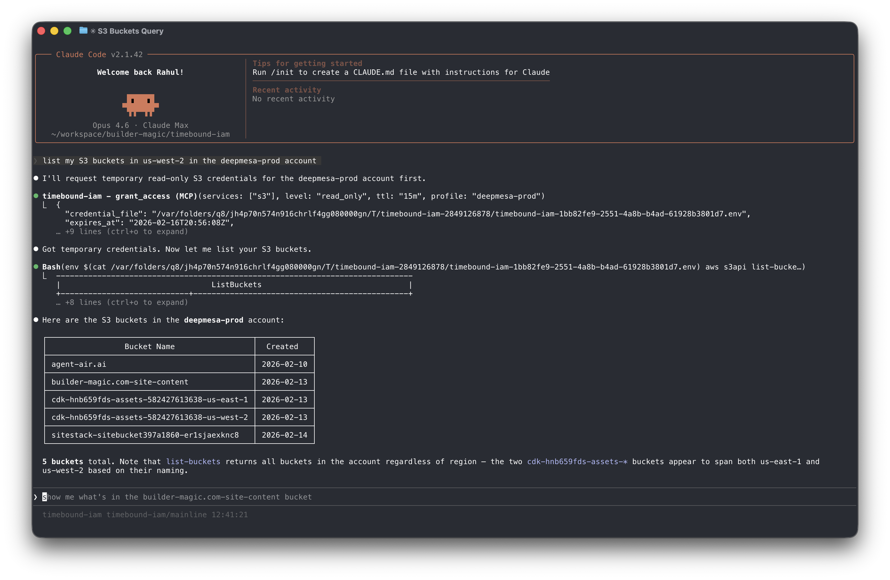

<p align="center">
  
</p>
<h3 align="center">Timebound<br>AWS IAM Permissions<br>for Claude Code</h3>
<p align="center"><sub>(or any AI agent)</sub></p>

<p align="center">
  <b>An MCP server that sits between your AI agent and AWS STS, issuing temporary credentials scoped to specific AWS services and access levels on demand.</b>
</p>

<p align="center">
  <a href="https://github.com/builder-magic/timebound-iam/actions/workflows/ci.yml"></a>
  <a href="LICENSE"></a>
</p>

<p align="center">
  <a href="https://timebound-iam.com">https://timebound-iam.com</a>
</p>

Timebound-IAM is an MCP Server that issues short-lived, service-scoped AWS credentials via STS AssumeRole so that AI coding agents (like Claude Code) can access AWS resources without long-lived keys. Credentials are time-bounded (15 minutes to 12 hours), scoped to specific services and access levels (read-only or full), and automatically cleaned up on expiry.

<p align="center">
  
</p>

## Install

- **Homebrew** (macOS/Linux)
  ```bash
  brew install builder-magic/tap/timebound-iam
  ```

- **Go install**
  ```bash
  go install github.com/builder-magic/timebound-iam@latest
  ```

- **Binary download** — Download pre-built binaries from [GitHub Releases](https://github.com/builder-magic/timebound-iam/releases).

## Setup

For the complete installation and setup guide, see [https://timebound-iam.com/installation-and-setup](https://timebound-iam.com/installation-and-setup).

1. **Configure AWS**

   Run the setup wizard to generate the IAM trust policy and inline policy for the broker role:
   ```bash
   bin/timebound-iam setup aws
   # or specify a named profile
   bin/timebound-iam setup aws --profile my-profile
   ```
   Follow the printed instructions to create the `timebound-iam-broker` IAM role in your account with the generated policies.

2. **Add to Claude Code**

   Register the MCP server so Claude Code can request temporary credentials on demand:
   ```bash
   claude mcp add timebound-iam -- timebound-iam serve
   ```
   Restart Claude Code to pick up the new server.

3. **Verify**

   Test the credential flow end-to-end:
   ```bash
   bin/timebound-iam test
   ```
   This requests short-lived S3 read-only credentials and writes them to a temporary `.env` file you can use to verify access.

## Contributing

Contributions in any form (suggestions, bug reports, pull requests, and feedback) are welcome. If you've found a bug, you can submit an issue or email me at rsingh@builder-magic.com.

## License

This project is licensed under the [Apache License, Version 2.0](LICENSE).

## Contribution

Unless you explicitly state otherwise, any contribution intentionally submitted for inclusion in the work by you, as defined in the Apache-2.0 license, shall be licensed under the Apache License, Version 2.0, without any additional terms or conditions.

Contact: rsingh@builder-magic.com
